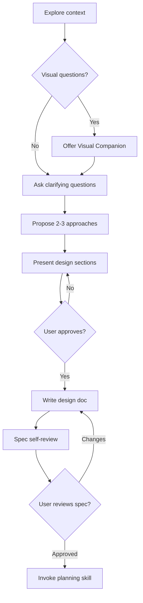

# Brainstorming Ideas Into Designs

Help turn ideas into fully formed designs and specs through natural collaborative dialogue. Start by understanding the current project context, then ask questions one at a time to refine the idea. Once you understand what you're building, present the design and get user approval.

> [!IMPORTANT]
> Do NOT invoke any implementation skill, write any code, scaffold any project, or take any implementation action until you have presented a design and the user has approved it. This applies to EVERY project regardless of perceived simplicity.

## When to use this skill
- Before any creative work: creating features, building components, adding functionality, or modifying behavior.
- Before beginning implementation planning or coding on a new requirement.
- When an idea is high-level and needs to be decomposed into specific requirements and architectures.

## Workflow

You MUST create a task for each of these items and complete them in order:
- [ ] **1. Explore project context** — Check files, docs, and recent commits.
- [ ] **2. Offer visual companion** (if visual questions expected) — Do this in its own message with no other content.
- [ ] **3. Ask clarifying questions** — Ask one at a time to understand purpose, constraints, and success criteria.
- [ ] **4. Propose 2-3 approaches** — Provide trade-offs and your recommended option.
- [ ] **5. Present design** — Present in sections, requesting user feedback and approval after each.
- [ ] **6. Write design doc** — Save to `docs/superpowers/specs/YYYY-MM-DD-<topic>-design.md` and commit.
- [ ] **7. Spec self-review** — Check inline for placeholders, contradictions, ambiguity, and scope.
- [ ] **8. User reviews written spec** — Ask user to approve the final spec file.
- [ ] **9. Transition to implementation** — Invoke the `planning` skill to create the implementation plan.

## Instructions

### 1. Ask Clarifying Questions (One at a Time)
- Explore the current codebase state first to understand active patterns.
- Ask questions one at a time. Do not overwhelm the user with a list of questions.
- Prefer multiple-choice questions when possible to make answering easy, but use open-ended if needed.
- Assess scope: if the request covers multiple independent subsystems, flag it immediately and help the user decompose the project into sub-projects first.

### 2. Propose 2-3 Approaches
- Always propose 2-3 distinct approaches with clear trade-offs.
- Lead with your recommended option and provide clear justification.

### 3. Presenting the Design
- Present the architectural design in sections. Ask after each section whether it looks right so far.
- Break the system into smaller, well-bounded units that each have a single clear purpose, communicate through well-defined interfaces, and can be tested independently.
- Stay focused on what serves the current goal; do not propose unrelated refactoring.

### 4. Spec Self-Review
After writing the spec document, check it for:
1. **Placeholder scan:** Any "TODO", "TBD", or vague requirements?
2. **Internal consistency:** Do any sections contradict each other?
3. **Scope check:** Is it focused enough for a single plan, or does it need further decomposition?
4. **Ambiguity check:** Is any requirement ambiguous? If so, clarify it.

## Resources
- [Spec Document Reviewer Prompt](resources/spec-document-reviewer-prompt.md)
- [Visual Companion Guide](resources/visual-companion.md)
