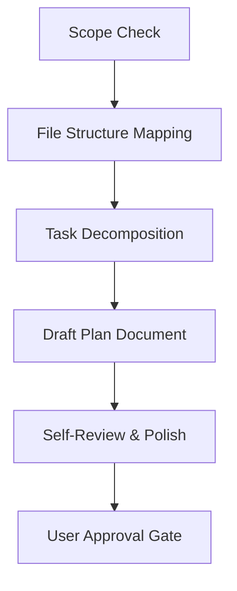

# Planning Code Implementation

Formulate comprehensive implementation plans assuming the developer has zero context for the codebase and needs highly explicit instructions. Document everything needed: files to touch, code templates, exact commands, and how to verify changes.

## When to use this skill
- You have a spec or requirements document for a multi-step task.
- You are ready to transition from design/brainstorming to actual code implementation.
- Before writing, editing, or modifying any code in the workspace.

## Workflow



You MUST create a task for each of these items and complete them in order:
- [ ] **1. Scope Check** — Ensure requirements are properly bounded. If too large, split into multiple plans.
- [ ] **2. File Structure Mapping** — Map out which files will be created or modified and their clear boundaries.
- [ ] **3. Task Decomposition** — Break the plan into bite-sized tasks (2-5 minutes of work each).
- [ ] **4. Draft Plan Document** — Write and save the plan in `docs/superpowers/plans/YYYY-MM-DD-<feature-name>.md`.
- [ ] **5. Self-Review** — Verify the plan against spec coverage, placeholder scan, and type consistency.
- [ ] **6. User Approval & Handoff** — Ask user to review before execution.

## Instructions

### 1. Scope Check
If the spec/design covers multiple independent subsystems, suggest breaking it into separate plans — one per subsystem. Each plan must produce working, testable software on its own.

### 2. File Structure Mapping
Before defining tasks, map out which files will be created or modified and what each one is responsible for.
- Design units with clear boundaries and well-defined interfaces.
- Prefer smaller, focused files over large ones that do too much.
- Split by responsibility, not by technical layer.
- In existing codebases, follow established patterns.

### 3. Bite-Sized Task Granularity
Each step must represent one clear action (2-5 minutes):
1. **Write failing test** (Red phase)
2. **Run test to verify failure**
3. **Write minimal implementation** (Green phase)
4. **Run test to verify it passes**
5. **Commit code** (Refactor / Checkpoint)

### 4. Plan Document Template
Every plan MUST start with this header and follow this task structure:

```markdown
# [Feature Name] Implementation Plan

> **For agentic workers:** Use the task-by-task execution pattern. Steps use checkbox (`- [ ]`) syntax for tracking.

**Goal:** [One sentence describing what this builds]
**Architecture:** [2-3 sentences about approach]
**Tech Stack:** [Key technologies/libraries]

---

### Task 1: [Component Name]

**Files:**
- Create: `exact/path/to/file.py`
- Modify: `exact/path/to/existing.py:123-145`
- Test: `tests/exact/path/to/test.py`

- [ ] **Step 1: Write the failing test**
```python
def test_specific_behavior():
    result = function(input)
    assert result == expected
```

- [ ] **Step 2: Run test to verify it fails**
Run: `pytest tests/path/test.py::test_name -v`
Expected: FAIL with "function not defined"

- [ ] **Step 3: Write minimal implementation**
```python
def function(input):
    return expected
```

- [ ] **Step 4: Run test to verify it passes**
Run: `pytest tests/path/test.py::test_name -v`
Expected: PASS

- [ ] **Step 5: Commit**
```bash
git add tests/path/test.py src/path/file.py
git commit -m "feat: add specific feature"
```
```

### 5. No Placeholders Rule
Every step must contain the actual content a developer needs. These are **plan failures** — never write them:
- "TBD", "TODO", "implement later", "fill in details"
- "Add appropriate error handling" or "add validation" (show the exact code/validation logic)
- "Write tests for the above" (without actual test code)
- "Similar to Task N" (repeat the code so tasks can be read out of order)

### 6. Plan Self-Review
After writing the complete plan, check it against this criteria before presenting:
1. **Spec coverage:** Can you point to a task for every requirement in the spec?
2. **Placeholder scan:** Are there any TBDs or vague instructions?
3. **Type consistency:** Are method signatures and property names consistent across all tasks?

## Resources
- [Plan Reviewer Prompt](resources/plan-document-reviewer-prompt.md)
